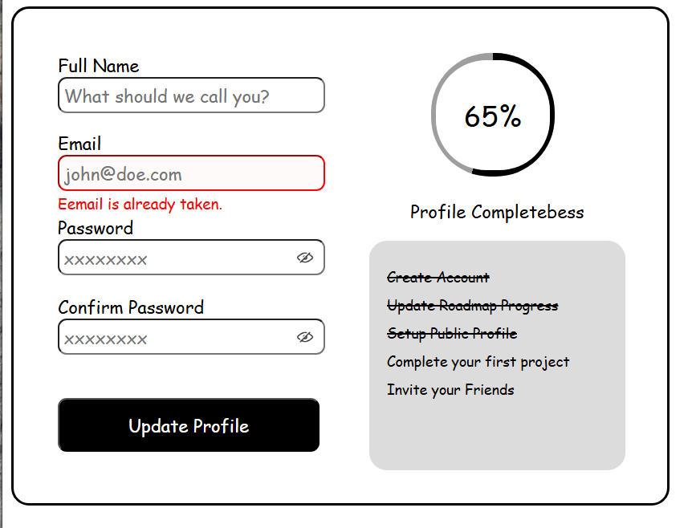

# Accessible Forn UI

#
An accessible form UI component using HTML and CSS. The form includes fields for a full name, email, password, and confirm password, along with a button to toggle the visibility of the password text.
Additionally, the form features a completeness progress bar and a checklist of requirements that must be met for the form to reach 100% completeness. While this version of the form won’t be functional, it will be a static UI component that can be enhanced with JavaScript in the future.
